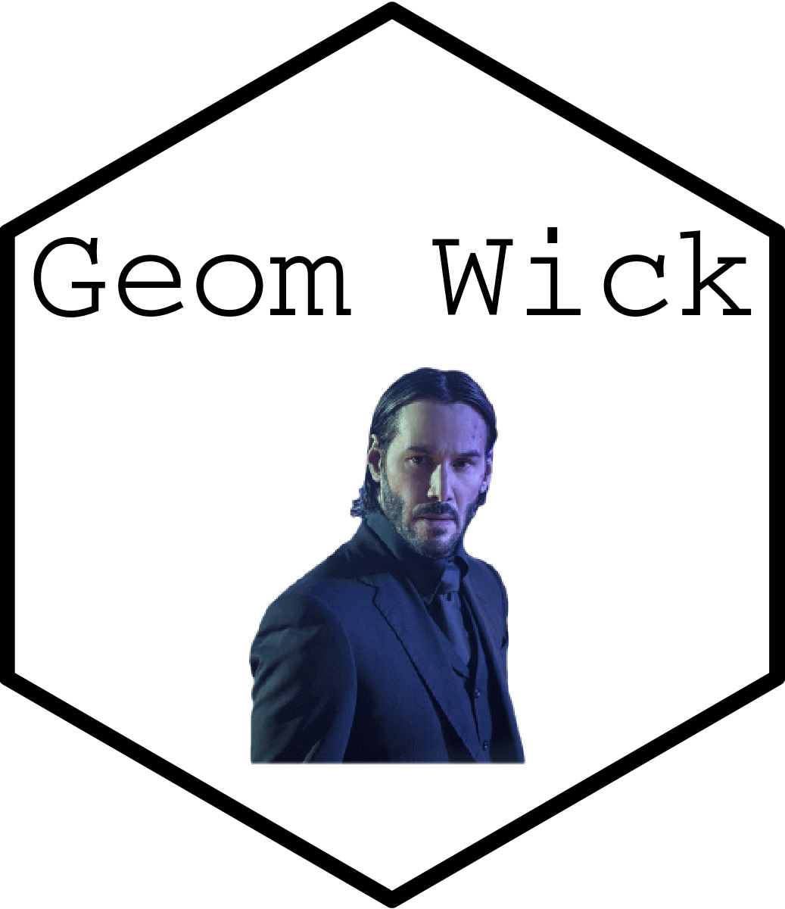
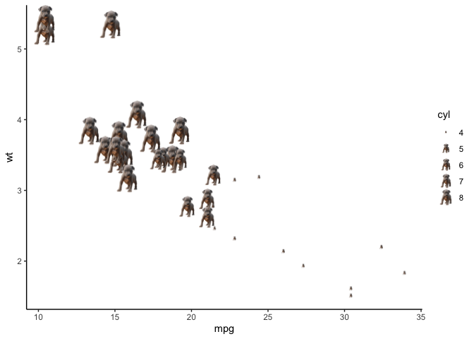
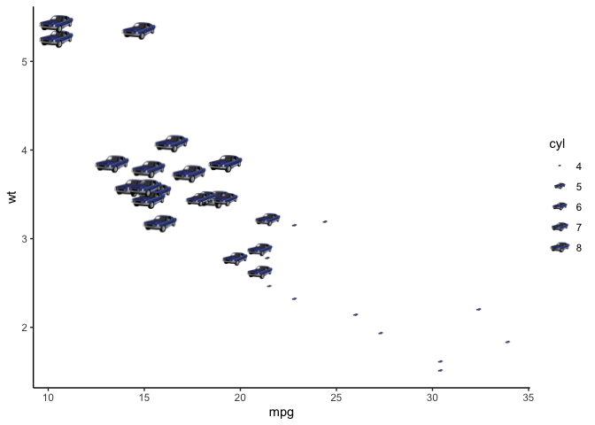

<!-- README.md is generated from README.Rmd. Please edit that file -->

# geomwick 

*“I heard you struck my son. May I ask why?”*

*“Because he stole John Wick’s car, sir. And uh, he killed his dog.”*

***“Oh.”***

<https://www.youtube.com/watch?v=r76WZ5gFWzY>

## About

`ggplot2` provides more then 40 geometric objects (geoms) but these
don’t cover all the possible plots one can make. Many developers have
created extension packages
(<https://exts.ggplot2.tidyverse.org/gallery/>), such as `ggridges` for
ridgeline plots for visualizing density of numerical variable for
different levels of a categorical variable, or `ggtext` for improved
text rendering support in plots. But nothing was available to create a
John Wick graph. As such this new geometric object based on John Wick
was created: Geom Wick. Instead of using `geom_point` or `geom_line`
consider using one of the functions in Geom Wick: `geom_wick`,
`geom_dog`, or `geom_car`.

## Installation

You can install the development version of geomwick like so:

``` r
remotes::install_github('andr3wli/geomwick')
```

## Example: John Wick

``` r
library(geomwick)
library(ggplot2)

ggplot(mtcars) +
  geom_wick(aes(mpg, wt, size = cyl)) +
  theme_classic()
```


## Example: John Wick’s dog

``` r
ggplot(mtcars) +
  geom_dog(aes(mpg, wt, size = cyl)) +
  theme_classic()
```



## Example: John Wick’s car

``` r
ggplot(mtcars) +
  geom_car(aes(mpg, wt, size = cyl)) +
  theme_classic()
```



## Acknowledgements

Hadley Wickham and the developers for
[ggplot2](https://ggplot2.tidyverse.org) and Leland Wilkinson and his
book [The Grammar of
Graphics](https://link.springer.com/book/10.1007/0-387-28695-0). Most
importantly, this project was entirely inspired and developed from work
done by [coolbutuseless](https://github.com/coolbutuseless).
